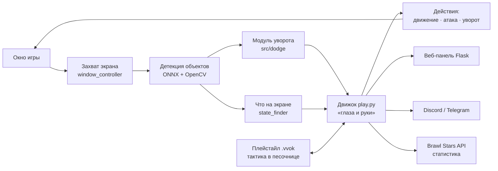
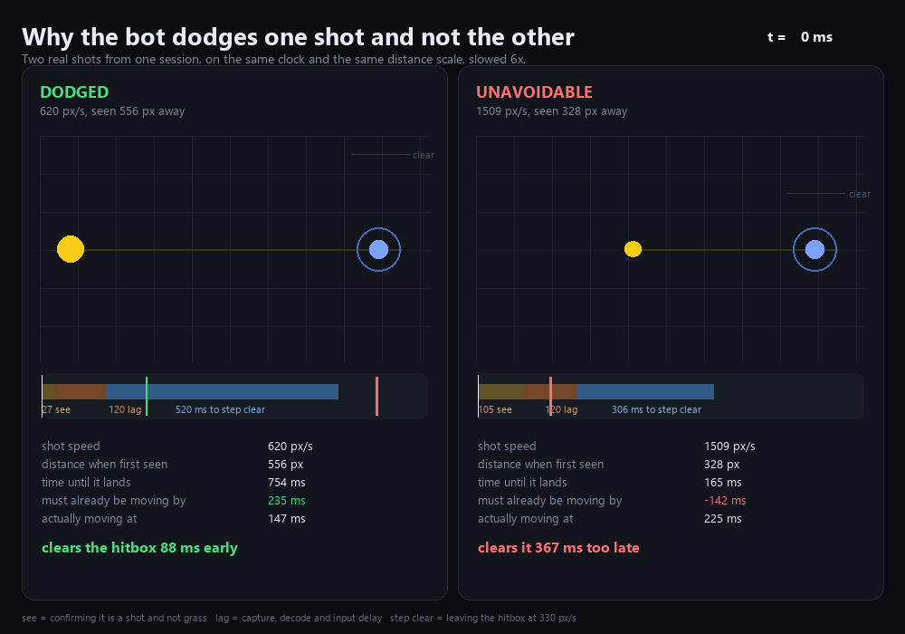

<h1 align="center">VvokAI</h1>

<p align="center">
  <b>Автономный бот для Brawl Stars, который видит бой глазами компьютерного зрения:</b><br>
  уворачивается от снарядов, стреляет с упреждением и двигается как человек.
</p>

<p align="center">
  
  
  
  
  
</p>

<p align="center"><b>Telegram: <a href="https://t.me/nyavke">@nyavke</a></b></p>

> [!IMPORTANT]
> **Не разработчик?** Скачайте готовый `.exe` из раздела **Releases** — сборка не требует Python и настраивается сама.

---

## 📑 Оглавление

- [О проекте](#-о-проекте)
- [Возможности](#-возможности)
- [Как это устроено](#-как-это-устроено)
- [Установка](#-установка)
- [Запуск и интерфейс](#-запуск-и-интерфейс)
- [Управление с телефона](#-управление-с-телефона)
- [Уворот от снарядов](#-уворот-от-снарядов)
- [Здоровье и тактика](#-здоровье-и-тактика)
- [Brawl Stars API и смена IP](#-brawl-stars-api-и-смена-ip)
- [Плейстайлы](#-плейстайлы)
- [Структура проекта](#-структура-проекта)
- [Технологии](#-технологии)
- [Тесты](#-тесты)
- [Дисклеймер](#-дисклеймер)

---

## 🎯 О проекте

VvokAI играет в Brawl Stars, **не имея доступа к памяти игры** — он работает только с картинкой на экране, ровно как человек. Каждый кадр проходит путь «увидел → решил → сделал»:

1. **Увидел** — захват окна, детекция объектов нейросетью (ONNX), поиск снарядов и чтение полосок здоровья.
2. **Решил** — отдельный модуль уворота предсказывает траектории снарядов, движок решает уравнение перехвата для стрельбы, а тактику задаёт пользовательский **плейстайл**.
3. **Сделал** — плавное движение, атака с упреждением и резкий уход с линии огня.

Логика игры (движок) и тактика (плейстайл) разделены намеренно: движок даёт только «глаза и руки», а *что делать* — описано в отдельном файле-скрипте, который можно менять без правки кода.

---

## ✨ Возможности

| Возможность | Как это работает |
|---|---|
| 🛡️ **Уворот от снарядов** | Детект движения → предсказание траекторий → выбор безопасного направления |
| 🎯 **Стрельба с упреждением** | Решение уравнения перехвата — удар туда, где враг *будет*, а не где *был* |
| 🚶 **Человеческое движение** | Плавное скольжение вместо рывков по 8 направлениям; резко — только в уворот |
| 🗺️ **Определение границ карты** | Измеряются по поведению камеры, а не задаются вручную |
| ❤️ **Чтение здоровья** | Отступает при низком HP, добивает раненых, выбирает добиваемую цель |
| 🧠 **Плейстайлы** | Вся тактика — в одном настраиваемом файле-скрипте `.vvok` |
| 📱 **Удалённое управление** | Полный набор команд через Discord и Telegram |
| 🔄 **Авто-обновление** | Подхватывает обновления на ходу, не прерывая матч, с бэкапом файлов |
| 🔑 **Само-восстановление ключа API** | Перевыпускает токен Brawl Stars при смене IP-адреса |
| 🖥️ **Два интерфейса** | Веб-панель (Flask) и десктоп-окно |
| ✅ **Покрытие тестами** | 22 набора автотестов на зрение, тактику и инфраструктуру |

---

## 🧩 Как это устроено



**Ключевая идея — разделение движка и тактики.** Движок отвечает за восприятие и физику действий, но *не решает*, что делать. Решение принимает плейстайл — скрипт, работающий в изолированной песочнице. Так тактику можно переписать, не трогая распознавание.

---

## 📥 Установка

### Вариант 1. Готовый EXE (рекомендуется)

Скачайте архив из **Releases**, распакуйте и запустите. Python и зависимости не нужны — сборка сама создаёт окружение при первом запуске.

### Вариант 2. Из исходников

Требуется [Python 3.11.9](https://www.python.org/downloads/release/python-3119/) (подойдёт любой 3.10–3.12).

1. Распакуйте архив.
2. **Запустите `start_vvok.bat` двойным щелчком.** Лаунчер сам создаст виртуальное окружение, установит зависимости и откроет интерфейс.

Из PowerShell запускать обязательно с `.\` впереди:

```powershell
.\start_vvok.bat
```

> Без `.\` PowerShell не ищет команды в текущей папке и отвечает `Имя "start_vvok.bat" не распознано как имя командлета`. В `cmd.exe` работает и без префикса.

### Вариант 3. Ускорение через CUDA (опционально)

Для видеокарт NVIDIA CUDA-сборка `onnxruntime` ускоряет распознавание примерно в **3.7 раза** (5.6 мс против 20.8 мс на RTX 3080 Ti):

```powershell
venv\Scripts\python.exe -m pip install "onnxruntime-gpu[cuda,cudnn]==1.28.0"
venv\Scripts\python.exe -m pip install torch torchvision --index-url https://download.pytorch.org/whl/cpu
```

> Вторая строка обязательна: CUDA-сборка PyTorch везёт собственный набор cuDNN, который конфликтует с onnxruntime. В боте torch нужен ровно для одной операции, поэтому CPU-версии достаточно.

---

## 🖥️ Запуск и интерфейс

| Запуск | Файл | Интерфейс |
|---|---|---|
| В браузере | `main.py` | Веб-панель на локальном порту |
| Отдельным окном | `desktop.py` | Десктоп-окно |

Через интерфейс выбираются бойцы, очередь прокачки, плейстайл и все настройки. Бот **не стартует сам** — он ждёт нажатия «Старт».

### Анонимная статистика

Раз в шесть часов бот отправляет обезличенные цифры: сколько сыграно матчей, винрейт по бойцам и стилям, версию и провайдер вычислений — чтобы понимать, что развивать.

**Ничего, что указывает на человека, не передаётся:** ни тега игрока, ни ника, ни токена, ни путей на диске. Единственное постоянное значение — случайное число, созданное при первом запуске. Отключается одной строкой в `cfg/general_config.toml`:

```toml
send_anonymous_stats = false
```

---

## 📱 Управление с телефона

Telegram и Discord принимают одинаковый набор команд:

```
/start   /stop   /pause   /status
/screenshot   /queue   /restart_game   /help
```

Нужны два значения — `telegram_token` и `telegram_chat_id` в [cfg/webhook_config.toml](cfg/webhook_config.toml). Если они уже заданы, команды заработают после перезапуска.

> Команды принимаются **только** из чата с указанным `telegram_chat_id`. Токен бота — единственный секрет: любой, у кого он есть, сможет писать боту.

---

## 🛡️ Уворот от снарядов



Подробный разбор — в **[DODGE.md](docs/DODGE.md)**.

Камера в Brawl Stars едет за игроком, поэтому при ходьбе весь фон выглядит как движение — на этом ломаются наивные детекторы. VvokAI режет шум **пятью независимыми фильтрами**:

1. Компенсация сдвига камеры по четырём патчам
2. Трёхкадровая разность
3. Палитра карты
4. Происхождение от бокса врага
5. Проверка прямолинейности траектории

**Замер на синтетическом стенде:** 0 ложных срабатываний при панорамировании камеры, ошибка скорости 0.2%, задержка обнаружения 100 мс, 3.3 мс на кадр.

### Настройка

Все параметры — в [cfg/dodge_config.toml](cfg/dodge_config.toml), каждый с объяснением. Главные:

| Параметр | Смысл |
|---|---|
| `reaction_latency` | Компенсация задержки видеопотока — **самый важный** |
| `motion_threshold` | Чувствительность детектора |
| `max_turn_rate` | Резкость поворотов при обычной ходьбе |
| `HOLD_RANGE_NEAR/FAR` | Дистанция боя (в шапке плейстайла) |

### Инструменты отладки

```powershell
venv\Scripts\python.exe tools\dodge_report.py --detail
```

Разбирает лог и объясняет, **почему** по боту попали: не увидел вовремя, не было выхода, упёрся в стену или тактика перевесила.

```powershell
venv\Scripts\python.exe tools\dodge_tune.py запись.mp4 --sweep vision.motion_threshold=8,12,16,20
```

Прогоняет детектор по видеозаписи и печатает таблицу «шум против сигнала» — порог подбирается по данным, а не на глаз.

---

## ❤️ Здоровье и тактика

Прочитав полоски HP, бот уходит из боя ниже **32%**, перестаёт сближаться ниже **55%**, добивает раненого врага и стреляет в того, кого можно добить, а не в ближайшего.

Если полоску прочитать не удалось — значение `None`, и тактика откатывается к прежней, дистанционной. **«Не прочитал» никогда не означает «полное здоровье».**

Настройки — секция `[health]` в [cfg/dodge_config.toml](cfg/dodge_config.toml), отключается одной строкой. Каждое измерение рисуется в отладочном окне: рамка вокруг полоски и процент рядом.

---

## 🔑 Brawl Stars API и смена IP

Supercell привязывает токен к IP-адресу, с которого он создан. Сменился адрес — токен мёртв, а API отвечает голым `403`.

Заполните `brawl_api_email` и `brawl_api_password`. При `403` бот сам зайдёт в портал разработчика, удалит свой прошлый ключ, выпустит новый под текущий адрес и повторит запрос — примерно две секунды, один раз на смену адреса. Адрес берётся из самого отказа API: он сообщает, с какого адреса видит запрос.

Удаляются только ключи с меткой `managed-by-vvokai` — созданное вручную не трогается.

> **Пароль в текстовом файле остаётся паролем в текстовом файле.** Он никуда не уходит, кроме сайта Supercell, и не пишется в логи. Альтернатива — прокси с постоянным адресом (пока не реализовано).
>
> **Чего не вылечит ничто:** если соединение выходит каждый раз с нового адреса (VPN с ротацией, мобильный интернет), ключ на один адрес не догонит его. Бот распознаёт это, прекращает попытки после двух неудач и сообщает прямо.

---

## 🧠 Плейстайлы

`playstyles/unified_dodge.vvok` объединяет четыре тактических блока (боевое дерево, следование за союзниками, ротация к центру, архетипы) и добавляет уворот.

Вся тактика — в одном файле, настройки в шапке. Файл исполняется в **изолированной песочнице** без встроенных функций и импортов: движок передаёт только «глаза» (список снарядов, скорости врагов, границы карты), а плейстайл возвращает решение.

| Файл | Назначение |
|---|---|
| `unified_dodge.vvok` | Основной: аккуратный, с приоритетом выживания |
| `unified_aggro.vvok` | Агрессивный |
| `unified_light.vvok` | Облегчённый — для слабых машин |
| `skeleton.py` | Шаблон для своего плейстайла |

---

## 📂 Структура проекта

```
VvokAI/
├── main.py               # запуск веб-интерфейса
├── desktop.py            # запуск в отдельном окне
├── launcher.py           # точка входа для сборки .exe
├── start_vvok.bat        # установка окружения и запуск
│
├── src/                  # исходный код
│   ├── play.py           # движок: восприятие → действие
│   ├── detect.py         # детекция объектов (ONNX)
│   ├── state_finder.py   # определение экрана игры
│   ├── window_controller.py  # захват окна и ввод
│   ├── trophy_observer.py    # история матчей, статистика
│   ├── auto_update.py    # обновление на ходу
│   ├── dodge/            # система уворота
│   │   ├── motion.py     #   детект движения
│   │   ├── palette.py    #   палитра карты
│   │   ├── tracker.py    #   треки снарядов
│   │   ├── solver.py     #   выбор направления уворота
│   │   ├── aim.py        #   упреждение и перехват
│   │   ├── vitals.py     #   чтение здоровья
│   │   └── smoothing.py  #   плавное движение
│   └── webui/            # веб-интерфейс (Flask)
│
├── playstyles/           # тактики (.vvok)
├── cfg/                  # конфигурация (.toml, .json)
├── tools/                # сборка, отладка, установка
├── tests/                # автотесты
└── docs/                 # документация (DODGE.md)
```

---

## 🛠️ Технологии

| Область | Инструменты |
|---|---|
| **Компьютерное зрение** | OpenCV, NumPy, ONNX Runtime (DirectML/CUDA) |
| **OCR** | EasyOCR — чтение здоровья и имён бойцов |
| **Управление устройством** | pywin32 (захват окна), adbutils (ADB), PyAV (видео) |
| **Веб-интерфейс** | Flask |
| **Боты** | discord.py, Telegram Bot API |
| **Сеть и данные** | requests, aiohttp, toml, pycryptodome |
| **Язык** | Python 3.10–3.12 |

---

## ✅ Тесты

```powershell
venv\Scripts\python.exe tests\run.py
```

**22 набора автотестов** покрывают: непрерывность треков снарядов на разных скоростях и частотах кадров, точность чтения здоровья и отсутствие ложных срабатываний на траве, тактические решения плейстайла и разрешение всех имён в песочнице `.vvok` (её отсутствие встроенных функций означает, что пропавший ключ контекста — это `NameError` посреди матча, а не ошибка при старте).

---

## ⚠️ Дисклеймер

Проект создан в исследовательских и учебных целях — как практика по компьютерному зрению, предсказанию траекторий и принятию решений в реальном времени.

Автоматизация игрового процесса нарушает условия использования Brawl Stars и Supercell и может привести к блокировке аккаунта. Используйте на свой страх и риск. Автор не несёт ответственности за последствия.

---

<p align="center">
  Вопросы и предложения — <a href="https://t.me/nyavke">@nyavke</a> в Telegram.
</p>
